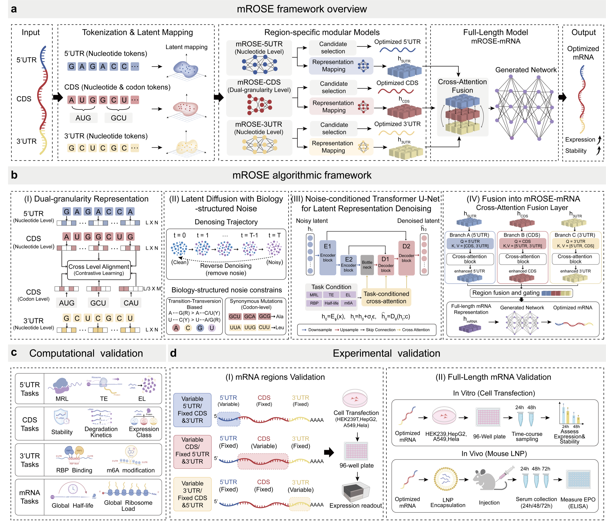

<p align="center">
  
</p>

# mROSE

**mROSE** is a region-aware diffusion framework for optimizing messenger RNA (mRNA) sequences for improved stability and protein expression. The project accompanies the manuscript **"mROSE: mRNA Optimization for Stability and Expression with a diffusion-based generative framework"**.

mROSE models the three major regulatory regions of an mRNA molecule with region-specific representations:

- **5′ UTR module** for translation initiation and mean ribosome loading prediction.
- **CDS module** for coding-region expression and degradation tasks using coupled codon-level and nucleotide-level representations.
- **3′ UTR module** for post-transcriptional regulation, including RNA-binding protein interaction and m6A-related regulatory prediction.
- **Full-length fusion module** for transcript-level stability and expression-associated phenotypes.

The manuscript describes mROSE as a conditional latent denoising framework that preserves biological constraints while exploring optimized sequence variants. In experimental validation, mROSE-designed erythropoietin mRNA increased serum protein expression in mice by up to 15.3-fold over the benchmark transcript.

<p align="center">
  
</p>

<p align="center"><em>Figure 1. Overview of the mROSE region-aware mRNA optimization workflow.</em></p>

## Why mROSE?

Therapeutic mRNA performance depends on sequence features distributed across the 5′ UTR, coding sequence and 3′ UTR. Rule-based design methods such as codon optimization, GC-content tuning or motif depletion can improve selected properties, but they often search only a narrow subset of possible sequence variants.

mROSE approaches mRNA design as a region-aware generative learning problem. It combines:

- region-specific sequence encoders,
- latent diffusion-style denoising,
- task-conditioned Transformer U-Net blocks,
- modular and full-length mRNA evaluation paths,
- protein-preserving synonymous exploration for CDS design.

This repository contains the research code organization, importable model modules, compact schema examples and task-specific training entry points for reproducing the code-level workflow.

## Repository layout

```text
mrose-github-project/
├── mrose/                         # Importable model modules
│   ├── module_5utr.py             # 5′ UTR module
│   ├── module_cds.py              # CDS dual-granularity module
│   ├── module_3utr.py             # 3′ UTR module
│   └── full_length_fusion.py      # Full-length mRNA fusion module
├── experiments/
│   ├── 5utr_mrl/                  # 5′ UTR mean ribosome loading regression
│   ├── cds_degradation/           # CDS degradation/stability regression
│   ├── 3utr_rbp/                  # 3′ UTR RBP interaction classification
│   └── full_length_stability/     # Full-length mRNA stability regression
├── generation/                    # Sequence generation entry points and demos
├── scripts/                       # Import checks and convenience launchers
├── docs/                          # Project and manuscript notes
├── data/                          # Data placement notes
├── outputs/                       # Ignored training outputs
├── environment.yml                # Conda environment
├── requirements.txt               # Core pip requirements
└── pyproject.toml                 # Python package metadata
```

## Installation

Create the conda environment:

```bash
conda env create -f environment.yml
conda activate mROSE
```

Or install the core pip dependencies:

```bash
pip install --extra-index-url https://download.pytorch.org/whl/cu118 -r requirements.txt
```

Check that the package imports correctly:

```bash
python scripts/quick_import_check.py
```

## Experiments

| Task family | Folder | Input format | Label type |
|---|---|---|---|
| 5′ UTR MRL regression | `experiments/5utr_mrl/` | CSV with `utr` and `rl` | continuous |
| CDS degradation regression | `experiments/cds_degradation/` | CSV with `Sequence` and `Value` | continuous |
| 3′ UTR RBP classification | `experiments/3utr_rbp/` | FASTA headers containing `class_0` or `class_1` | binary |
| Full-length mRNA stability regression | `experiments/full_length_stability/` | CSV with `sequence` and `label` | continuous |

Run the compact examples from the repository root:

```bash
bash experiments/5utr_mrl/example/run_example.sh
bash experiments/cds_degradation/example/run_example.sh
bash experiments/3utr_rbp/example/AKAP1_HepG2/run_example.sh
bash experiments/full_length_stability/example/run_example.sh
```

The example datasets are intentionally small and are included to document file formats, loader expectations and command-line usage. Full training datasets and checkpoints should be stored outside normal Git history.

## Sequence generation

mROSE also includes standalone generation entry points for designing region-specific candidate sequences:

| Region | Script | Output |
|---|---|---|
| 5′ UTR | `generation/5utr/generate_5utr.py` | scored 5′ UTR candidates with predicted MRL, MFE, GC and uORF/uAUG features |
| CDS | `generation/cds/generate_cds.py` | length-matched CDS candidates ranked by model score, CAI, GC and optional MFE |
| 3′ UTR | `generation/3utr/generate_3utr.py` | scored 3′ UTR candidates with degradation-style prediction, MFE, GC/TC and motif penalties |

Large generation checkpoints are not committed to Git. For local use, place the model files under:

```text
checkpoints/generation/
├── 5UTR_Model.pth
├── CDS_Model.pth
└── 3UTR_Model.pth
```

Print demo commands and check local dependencies/checkpoints:

```bash
python scripts/demo_generate_sequences.py
```

Run a compact local demo:

```bash
python scripts/demo_generate_sequences.py --run cds
```

See [generation/README.md](generation/README.md) for direct commands for 5′ UTR, CDS and 3′ UTR generation.

## Data and checkpoints

Large datasets and model artifacts are not committed to this repository. For full-scale training or release, use one of the following:

- Git LFS for files that must remain attached to the repository.
- DVC for reproducible data and model pipelines.
- Zenodo, Figshare or institutional repositories for citable public datasets.
- A local `data/raw/` directory ignored by Git.

See [DATA_MANIFEST.md](DATA_MANIFEST.md) for expected dataset locations and schema notes.

## Project status

This repository packages the uploaded mROSE research code into a GitHub-ready project. Some scripts retain conventions from the original research environment, including distributed training launch patterns and local data paths. The included wrappers and example files are intended to make those conventions explicit without committing large datasets or generated outputs.

## Citation

If you use this code, please cite the associated manuscript:

> mROSE: mRNA Optimization for Stability and Expression with a diffusion-based generative framework.

See [CITATION.cff](CITATION.cff) for repository citation metadata.

## License

A formal open-source license has not yet been selected. See [LICENSE_NOTICE.md](LICENSE_NOTICE.md) before public redistribution or reuse.
